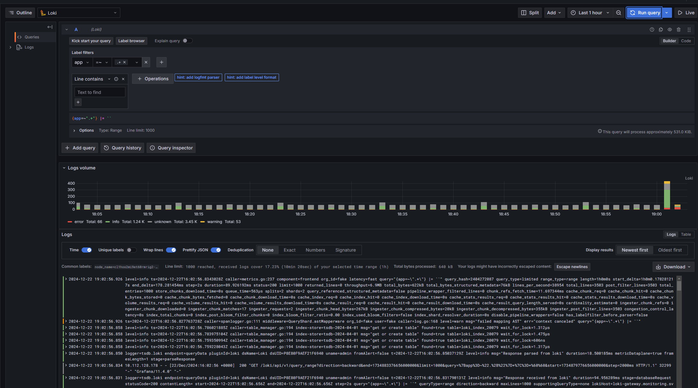

# Выполнено ДЗ №9 Сервисы централизованного логирования для Kubernetes.

 - [x] Основное ДЗ 

## В процессе сделано:
 - YandexCloud создал кластер k8s.
 - Создал два пула нод `infra` и `worker`.
 - Через `helmfile` установил loki, grafana, promtail.
 - Настроил loki для работы с s3 yandexcloud.


## Как запустить проект:
 - Выполнить:
```shell
 helmfile sync --set=loki.storage.s3.s3=s3://****:****@storage.yandexcloud.net/infra-loki
```

## Как проверить работоспособность:
```shell
❯ kubectl get node -o wide --show-labels
NAME                        STATUS   ROLES    AGE     VERSION   INTERNAL-IP   EXTERNAL-IP       OS-IMAGE             KERNEL-VERSION      CONTAINER-RUNTIME     LABELS
cl14cju01uqccgnopbjk-efit   Ready    <none>   3d8h    v1.30.1   10.129.0.33   158.160.81.204    Ubuntu 20.04.6 LTS   5.4.0-187-generic   containerd://1.6.28   beta.kubernetes.io/arch=amd64,beta.kubernetes.io/instance-type=standard-v3,beta.kubernetes.io/os=linux,failure-domain.beta.kubernetes.io/zone=ru-central1-b,kubernetes.io/arch=amd64,kubernetes.io/hostname=cl14cju01uqccgnopbjk-efit,kubernetes.io/os=linux,node-role.kubernetes.io=worker,node.kubernetes.io/instance-type=standard-v3,node.kubernetes.io/kube-proxy-ds-ready=true,node.kubernetes.io/masq-agent-ds-ready=true,node.kubernetes.io/node-problem-detector-ds-ready=true,topology.kubernetes.io/zone=ru-central1-b,yandex.cloud/node-group-id=catpthsql58ap9sftqer,yandex.cloud/pci-topology=k8s,yandex.cloud/preemptible=false
cl1hos2mi9et60rmrig2-iniw   Ready    <none>   3d18h   v1.30.1   10.130.0.10   158.160.136.167   Ubuntu 20.04.6 LTS   5.4.0-187-generic   containerd://1.6.28   beta.kubernetes.io/arch=amd64,beta.kubernetes.io/instance-type=standard-v3,beta.kubernetes.io/os=linux,failure-domain.beta.kubernetes.io/zone=ru-central1-d,kubernetes.io/arch=amd64,kubernetes.io/hostname=cl1hos2mi9et60rmrig2-iniw,kubernetes.io/os=linux,node-role.kubernetes.io=infra,node.kubernetes.io/instance-type=standard-v3,node.kubernetes.io/kube-proxy-ds-ready=true,node.kubernetes.io/masq-agent-ds-ready=true,node.kubernetes.io/node-problem-detector-ds-ready=true,topology.kubernetes.io/zone=ru-central1-d,yandex.cloud/node-group-id=catopo141iha7g2dmdu1,yandex.cloud/pci-topology=k8s,yandex.cloud/preemptible=false
```
```shell
❯ kubectl get nodes -ocustom-columns=NAME:.metadata.name,TAINTS:.spec.taints
NAME                        TAINTS
cl14cju01uqccgnopbjk-efit   <none>
cl1hos2mi9et60rmrig2-iniw   [map[effect:NoSchedule key:node-role value:infra]]
```
Получить пароль для доступа в grafana
```shell
kubectl get secret --namespace monitoring grafana -o jsonpath="{.data.admin-password}" | base64 --decode ; echo
```
Сделать порт форвординг
```shell
kubectl port-forward --namespace monitoring svc/grafana 3000:3000
```
Скриншот с логами loki в графане.


## PR checklist:
 - [x] Выставлен label с темой домашнего задания
