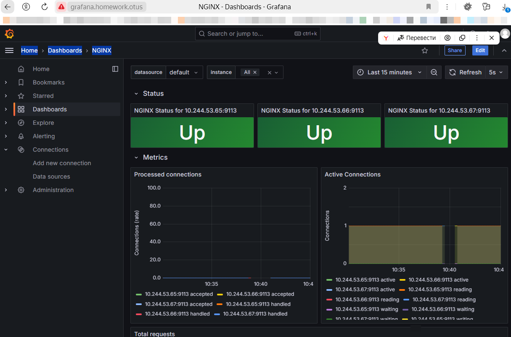

# Выполнено ДЗ №8. Мониторинг приложения в кластере

- [x] Основное ДЗ

## В процессе сделано:
- Настроен образ nginx для отдачи статистики на порту 8080 и endpoint server-status
- В развёртывание nginx добавлен контейнер metrics с `nginx/nginx-prometheus-exporter` для преобразования 
статистики nginx в формат метрики prometheus.
- C помощью helmfile развёрнуты prometheus-operator и grafana. 
- С помощью values в helmfile в grafana добавлено подключение к prometheus 
и дашборд для отображения метрик nggix. С помощью ingress выведен ui grafana через хост grafana.homework.otus. 
- Добавлена настройка для экспорта метрик из приложения nginx. 


## Как запустить проект:
- Создать все объекты

```shell
cd kubernetes-security
kubectl create -f namespace.yaml
kubectl create -f nginx-configmap.yaml
kubectl create -f deployment.yaml
kubectl create -f service.yaml
kubectl create -f my-service-monitor.yaml
kubectl create -f prometeus.yaml
```
- Установить prometheus и grafana
```shell
helmfile sync
```

## Как проверить работоспособность:
- Настроить hosts для доступа к `grafana.homework.otus`
- Получить пароль для доступа к ui grafana
```shell
kubectl get secret --namespace homework grafana -o jsonpath="{.data.admin-password}" | base64 --decode ; echo
```
- Перейти http://grafana.homework.otus Home -> Dashboards -> NGINX


## PR checklist:
- [x] Выставлен label с темой домашнего задания
